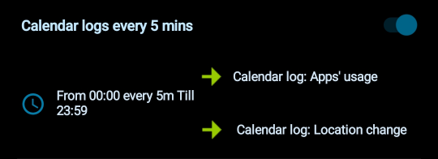
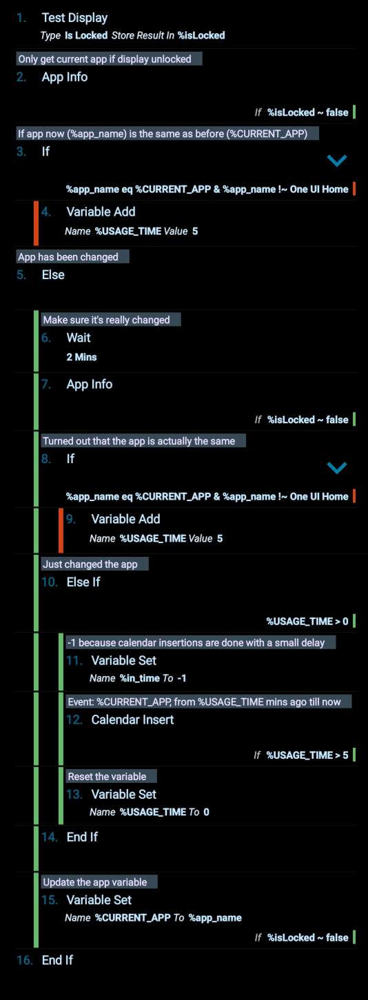

# Tasker: automatic calendar log
Automatically log your phone apps' usage &amp; travel time into your Google Calendar (via Tasker), in order see how much time you're spending on it and be able to plan your day more effectively!

## Prerequisites
Make sure you have [Tasker](https://play.google.com/store/apps/details?id=net.dinglisch.android.taskerm&hl=en_US) installed on your device _(it is available on Android)_.
 

## Project files

### [Calendar_logs_every_5_mins.prf.xml](Calendar_logs_every_5_mins.prf.xml)
It is a Tasker ***Profile*** that runs the 2 ***Tasks*** at certain times (each 5 minutes).
#### 

### [Calendar_log__Apps__usage.tsk.xml](Calendar_log__Apps__usage.tsk.xml)
It is a ***Task*** that performs certain actions, including:
* saving the currently open app's name into a global variable: _%CURRENT_APP_,
* calculating the time that has been spent in the app (to the nearest 5 minutes) and saving it into a global variable: _%USAGE_TIME_,
* inserting an event with the app's name into your calendar (if the app is not used anymore but was used for more than 5 minutes).
#### 
_(Note: make sure to give Tasker permissions to one of your calendars, and choose it within the **12. Calendar Insert** action.)_
 
#### 

### [Calendar_log__Location_change.tsk.xml](Calendar_log__Location_change.tsk.xml)
Another ***Task*** that performs, among others:
* saving the current location data into global variables: _%LATITUDE_ and _%LONGITUDE_,
* calculating the distance between the current location and the previous one,
* calculating how long the distance has been changing (to the nearest 5 minutes) and saving it into a global variable: _%TRAVEL_TIME_,
* inserting an event if into your calendar once the location stops changing.
#### 
_(Note: make sure to give Tasker permissions to one of your calendars, and choose it within the **14. Calendar Insert** action.)_
 
#### 
